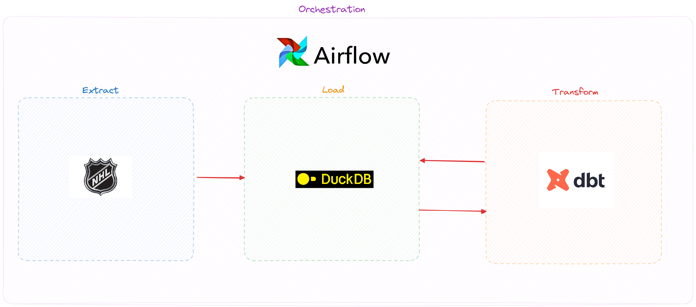

# NHL MDS in a Box

This repository is a monorepo of multiple projects that mimic the processes involved in the so-called modern data stack (MDS). This repo will follow the data integration paradigm of Extract, Load, Transform (ELT).

Four projects and one database represent the stack in its entirety, and can be seen in the image below:

More details for each section can be found in the READMEs for their respective projects.

## Data: The DuckDB Database

[DuckDB](https://duckdb.org/) is an in-process OLAP database management system (DBMS). To break it down:

- In-process: runs directly within an application,
- OLAP: stands for Online Analytical Processing,
- Database management system: software that creates and manages databases.

If you are familiar with [SQLite](https://www.sqlite.org/), you can think of DuckDB as SQLite for analytics. SQLite is an in-process database that is optimized for transactional queries, otherwise known as an Online Transaction Processing (OLTP) database. These databases are great for row-based work, such as creating, inserting, and updating particular records in a table. Other popular OLTP databases include [PostgreSQL](https://www.postgresql.org/) and [MySQL](https://www.mysql.com/).

With an OLAP database like DuckDB, instead of being optimized for row-based queries, the database is instead optimized for column-based queries. These queries involve aggregations, window functions, among others and is useful for analytical work. Basically, if your question on a dataset involves a "who," "what," "when," "where", "how much" type of question, you'll want to opt for an OLAP database. Other examples of an OLAP database include [Snowflake](https://www.snowflake.com/en/) and [Databricks](https://www.databricks.com/). However, these OLAP database solutions are cloud-based.

All data that get outputted by all other projects in this repository will land in this directory.

## Extract: The dlt Project

[dlt](https://dlthub.com/) is an up-and-coming tool that aims to make it easy for data practitioners to extract data from various sources with minimal Python code. Instead of relying on huge cloud-based providers like [Stitch](https://www.stitchdata.com/) or difficult-to-maintain [Singer](https://www.singer.io/) taps, we can use modular dlt functions to easily create and maintain extraction pipelines. A solution like this works well for the MDS-in-a-box concept as we can extract data from sources without having to navigate away from this repository.

## Transform: The dbt Project

[dbt](https://www.getdbt.com/) is **the** standard for data transformation work in the modern data stack. I'd even go as far as saying that if dbt isn't involved in the data stack, it shouldn't be considered a "modern" data stack.

dbt gives data practitioners the ability to do many things that was previously unavailable. For starters, it enables a git workflow for data development work, meaning that we can actually track and make changes to queries against our data warehouses. No more mystery data with vague origins.

The second thing that dbt provides is the ability to track the lineage of our data. In other words, we can see how our data is flowing from one table to another, or see which table depend on another table. This is represented by a [directed acyclic graph (DAG)](https://en.wikipedia.org/wiki/Directed_acyclic_graph) which dbt also generates for us.

dbt models are written in SQL, templated by [Jinja](https://jinja.palletsprojects.com/en/stable/). Because of this, dbt must be installed in a Python environment. However, this also means that we'll have great synergy with the rest of the repository as the entire stack will be requiring Python anyway.

Lastly, dbt is perfect for an "in-a-box" repository as we can run our dbt models to create new tables straight from the command line. No cloud services required.

## Orchestration: The Airflow Project

[Apache Airflow](https://airflow.apache.org/) is incredibly hard to beat. It's Python-based, has an API that helps create an easy to maintain codebase, has thorough documentation, provides an enormous list of providers and plugins, and comes with a ready-to-use web interface that can be launched locally. There's little wonder it's still the industry standard when it comes to orchestrating code and data pipelines. This project will extract data from defined dlt sources, run dbt models after extraction is completed, and monitors these processes should they return errors or warnings.

## Streamlit: An Example of a Deliverable Data Product

Instead of extensively coding up a web app to host a dashboard with various visualization libraries, we can use a single Python library to do all of that work for us. Streamlit is a way to create quick and robust interactive data apps with an ever-growing list of features and a well-documented API. Streamlit provides users a friendly way into a dataset, letting them input the parameters they would like set against the data and a way to customize how that data is presented.
